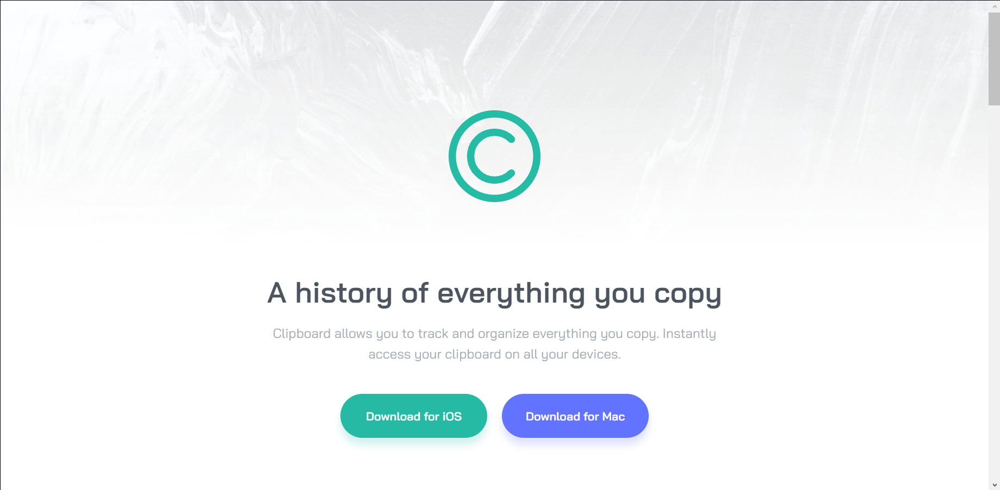
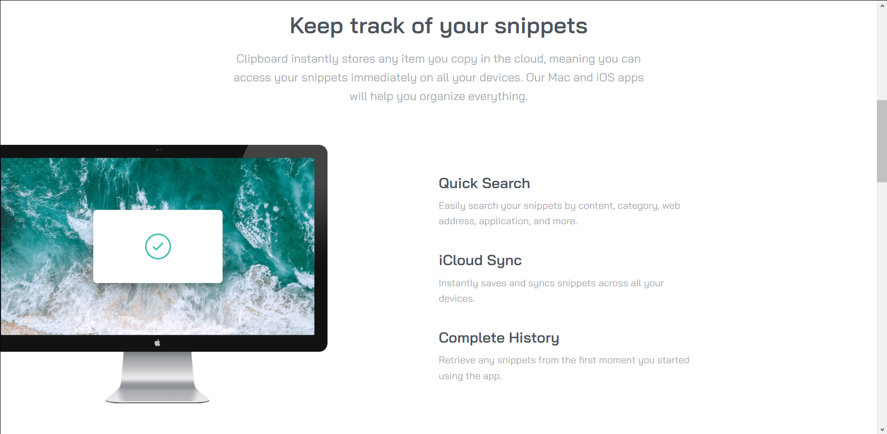
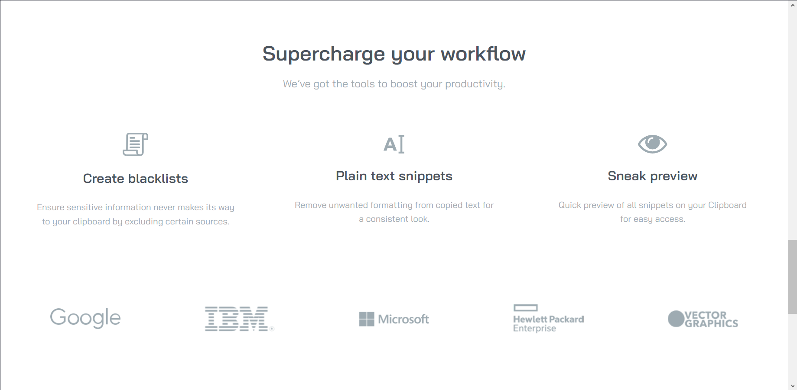

# Frontend Mentor - Clipboard landing page solution

This is a solution to the [Clipboard landing page challenge on Frontend Mentor](https://www.frontendmentor.io/challenges/clipboard-landing-page-5cc9bccd6c4c91111378ecb9). Frontend Mentor challenges help you improve your coding skills by building realistic projects. 

## Table of contents

- [Overview](#overview)
  - [The challenge](#the-challenge)
  - [Screenshot](#screenshot)
  - [Links](#links)
- [My process](#my-process)
  - [Built with](#built-with)
- [Author](#author)

## Overview

### The challenge

Users should be able to:

- View the optimal layout for the site depending on their device's screen size
- See hover states for all interactive elements on the page

### Screenshot

### Links

- Solution URL: [Solution URL](https://www.frontendmentor.io/solutions/clipboard-landing-page-built-with-vuejs-5yC8w5Wllj)
- Live Site URL: [Live Site URL](https://clipboard-landing-page-k23m7avzv-ted-bankongs-projects.vercel.app)

## My process

### Built with

- Semantic HTML5 markup
- CSS custom properties
- Flexbox
- Mobile-first workflow
- [Vue](https://vuejs.org) - JS library

## Author

- Instagram - [@mrbankong](https://www.instagram.com/mrbankong)
- Frontend Mentor - [@tedobanks](https://www.frontendmentor.io/profile/tedobanks)
- Twitter - [@tedbankong](https://www.twitter.com/tedbankong)
